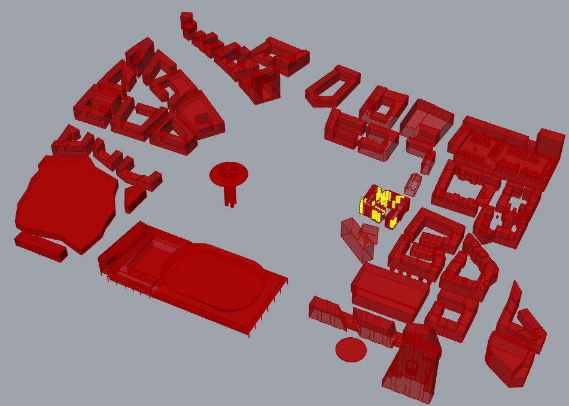
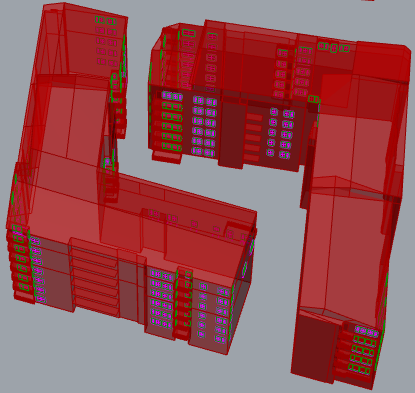
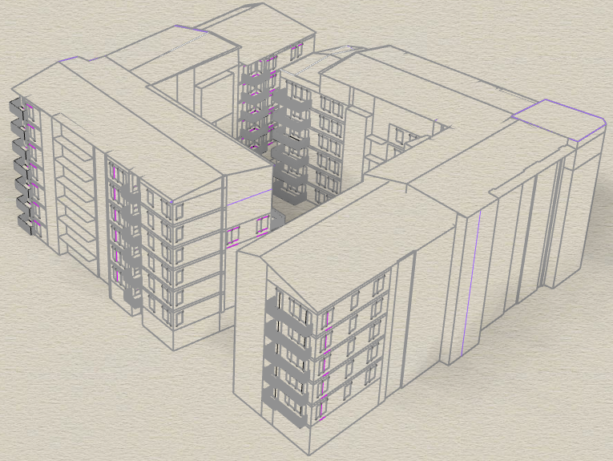
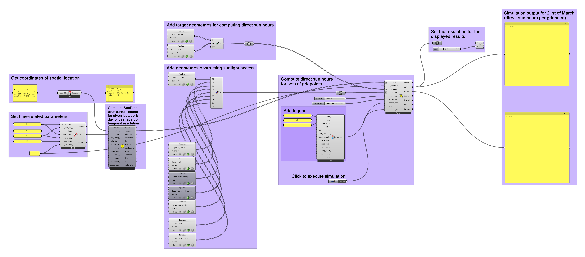
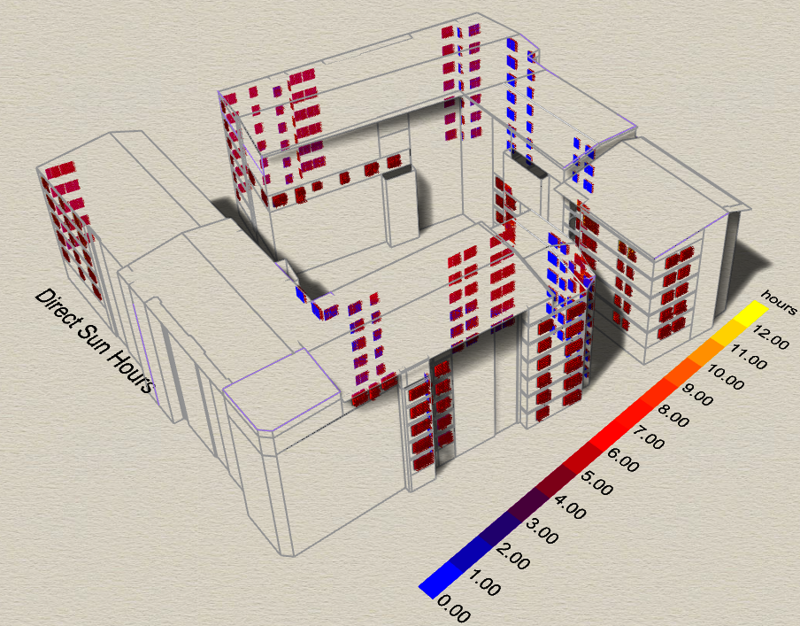
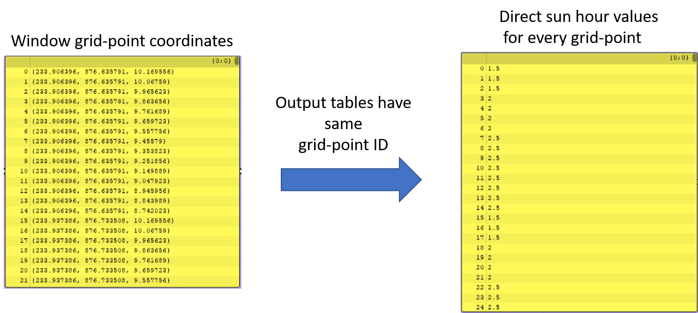

# Direct Sun Hours
The Grasshopper script-file included in this repository is used for computing the direct sun hours on windows and balcony doors of a set of buildings in a neighbourhood. Some of the buildings in the study area are represented in high level of detail (equivalent to [CityGML LOD4](https://www.sciencedirect.com/science/article/pii/S0198971516300436?via%3Dihub)), while others are represented in a lower level of detail (equivalent to [CityGML LOD2](https://www.sciencedirect.com/science/article/pii/S0198971516300436?via%3Dihub)). The goal is to examine how including or excluding obstructing gemmetries (e.g. balconies, balcony railings, etc.) of buildings represented in a high level of detail affect the results of daylight metric simulations such as the Sunlight Exposure (here expressed as direct sun hours).

 
 

## Direct Sunlight Exposure (definition):
Sunlight exposure is regulated by the Swedish Standard, which is based on the European Standard [EN 17037 - *Daylight in Buildings*](https://velcdn.azureedge.net/~/media/marketing/ee/professional/28mai2019%20seminar/veluxen17037tallinn28052019.pdf), and states that at minimum one room in an apartment has to receive at least 1.5 hours of direct sunlight on one day between February 1st and March 21st of a year.

 
 

## Input data:
- 3D city model including detailed building exterior information (equivalent to [CityGML LOD4](https://www.sciencedirect.com/science/article/pii/S0198971516300436?via%3Dihub)) like e.g. windows, balconies, balcony railings, etc. 

 

The below figure depicts a example of a 3D city model that can be used as input. The windows of the *target buildings* for which we are going to compute the direct sun hours for, are highlighted in yellow.

 

</img>

 
 

The next figures give you the opportunity to get a closer look over the *target buildings*.

 
 

</img>&emsp;</img>

 
 

## Requirements:

- An installed version of [Rhino 7](https://www.rhino3d.com/) with the following tools:
  - [Grasshopper](https://www.grasshopper3d.com/)
  - [LadyBug](https://www.ladybug.tools/ladybug.html)

 
 

## Workflow:
The process depicted in this workflow computes the Direct Sun Hour values calculated for March 21st (0.5 min temporal resolution) over a grid of points (0.1m resolution) placed over every window in the target buildings (see figure in *Input data* section). . Finally, this implementation also takes into consideration how using different building facade materials and colours affects daylight access.

 

<ins><b>Step 1:</ins></b> Add the geometries (Geometry Pipeline) of the room (walls, ceiling, floor, windows, eaves)   
<ins><b>Step 2:</ins></b> Add the geometries (Geometry Pipeline) of the obstructions (e.g. ground, building facades of surrounding buildings, balconies of surrounding buildings, balcony railings of surrounding buildings)   
<ins><b>Step 3:</ins></b> Add a slider and a panel with the standard height value of a floor (2.79m). Include a multiplier to combine the slider and the floor height values to obtain the elevation coordinates (z-coord) of the different room-related geometries from floor to floor.   
<ins><b>Step 4:</ins></b> Add one Climate Studio *LightingMaterial* module per obstructing geometry to pick an appropriate material and colour with specific spectral properties.   
<ins><b>Step 5:</ins></b> Add one Climate Studio *LightingMaterial* module for every room-related geometry and pick an appropriate material and colour.  
<ins><b>Step 6:</ins></b> Add a Climate Studio *SceneLayer* module to construct a Scene Layer for daylight simulation, one for every geometry.  
<ins><b>Step 7:</ins></b> Add a sensor grid (using the Climate Studio *SensorGrid* module) with 0.2m resolution and placed 0.8m above a room floor surface.  
<ins><b>Step 8:</ins></b> Add a *Boolean Toggle* in combination with two *Cull Pattern* modules to control when balcony and balcony railing geometries are to be included as obstructions in the DF-computation and when not.   
<ins><b>Step 9:</ins></b> Add Climate Studio *DaylightModel* to prepare the scene for running the DF daylight simulation.  
<ins><b>Step 10:</ins></b> Add a Climate Studio *Daylight* module and select *Daylight Factor* as the chosen standard to run the corresponding daylight .   

</img>

 
 

## Output:
The computed Direct Sun Hours for every point in the grid is presented in the Rhino environment as a visual output while the corresponding values along with the grid-point coordinates the refer to are exported to 2 panels inside the Rhino Grasshopper environment. The panel contents can be exported to txt-files and imported to GIS environments for further processing.

</img>

 
 
 
 

</img>

 
 
 
 

## References:

EN 12665:2018, Light and lighting — Basic terms and criteria for specifying lighting requirements.
 

Ladybug Rhino Grasshopper plugins: https://www.ladybug.tools/ladybug.html#solaraccess

 
 
 
 

## License
Copyright 2023 Sustainable3DCities    
The 3-Clause BSD License  
https://opensource.org/licenses/BSD-3-Clause  
   
Redistribution and use in source and binary forms, with or without modification, are permitted provided that the following conditions are met:

1. Redistributions of source code must retain the above copyright notice, this list of conditions and the following disclaimer.

2. Redistributions in binary form must reproduce the above copyright notice, this list of conditions and the following disclaimer in the documentation and/or other materials provided with the distribution.

3. Neither the name of the copyright holder nor the names of its contributors may be used to endorse or promote products derived from this software without specific prior written permission.

THIS SOFTWARE IS PROVIDED BY THE COPYRIGHT HOLDERS AND CONTRIBUTORS "AS IS" AND ANY EXPRESS OR IMPLIED WARRANTIES, INCLUDING, BUT NOT LIMITED TO, THE IMPLIED WARRANTIES OF MERCHANTABILITY AND FITNESS FOR A PARTICULAR PURPOSE ARE DISCLAIMED. IN NO EVENT SHALL THE COPYRIGHT HOLDER OR CONTRIBUTORS BE LIABLE FOR ANY DIRECT, INDIRECT, INCIDENTAL, SPECIAL, EXEMPLARY, OR CONSEQUENTIAL DAMAGES (INCLUDING, BUT NOT LIMITED TO, PROCUREMENT OF SUBSTITUTE GOODS OR SERVICES; LOSS OF USE, DATA, OR PROFITS; OR BUSINESS INTERRUPTION) HOWEVER CAUSED AND ON ANY THEORY OF LIABILITY, WHETHER IN CONTRACT, STRICT LIABILITY, OR TORT (INCLUDING NEGLIGENCE OR OTHERWISE) ARISING IN ANY WAY OUT OF THE USE OF THIS SOFTWARE, EVEN IF ADVISED OF THE POSSIBILITY OF SUCH DAMAGE.
