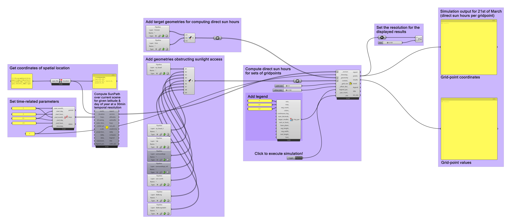
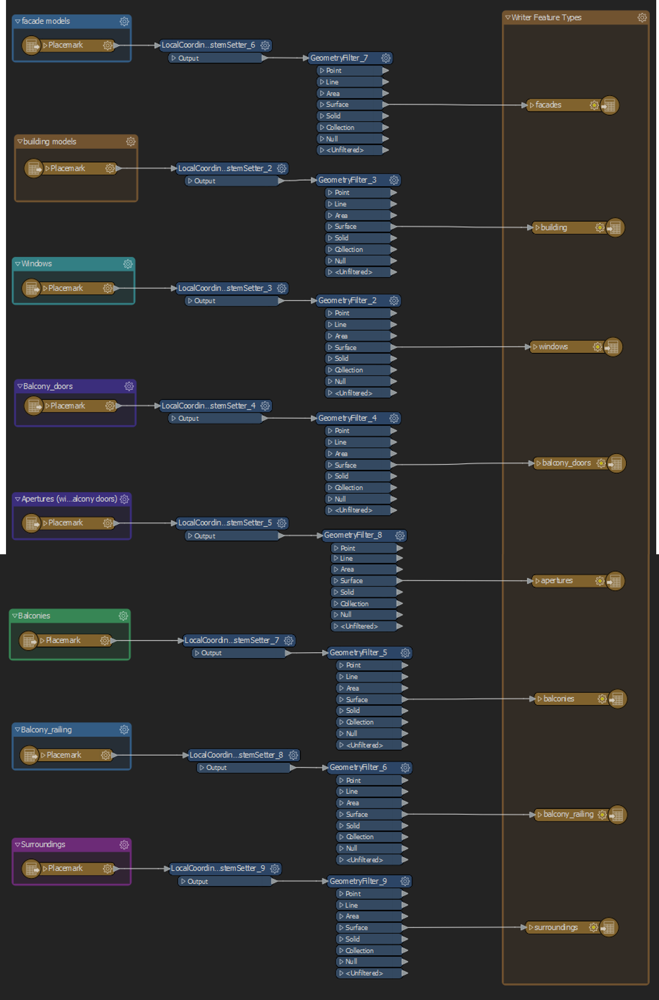
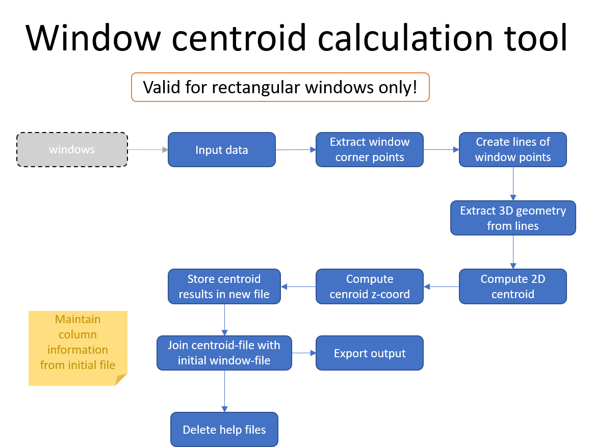
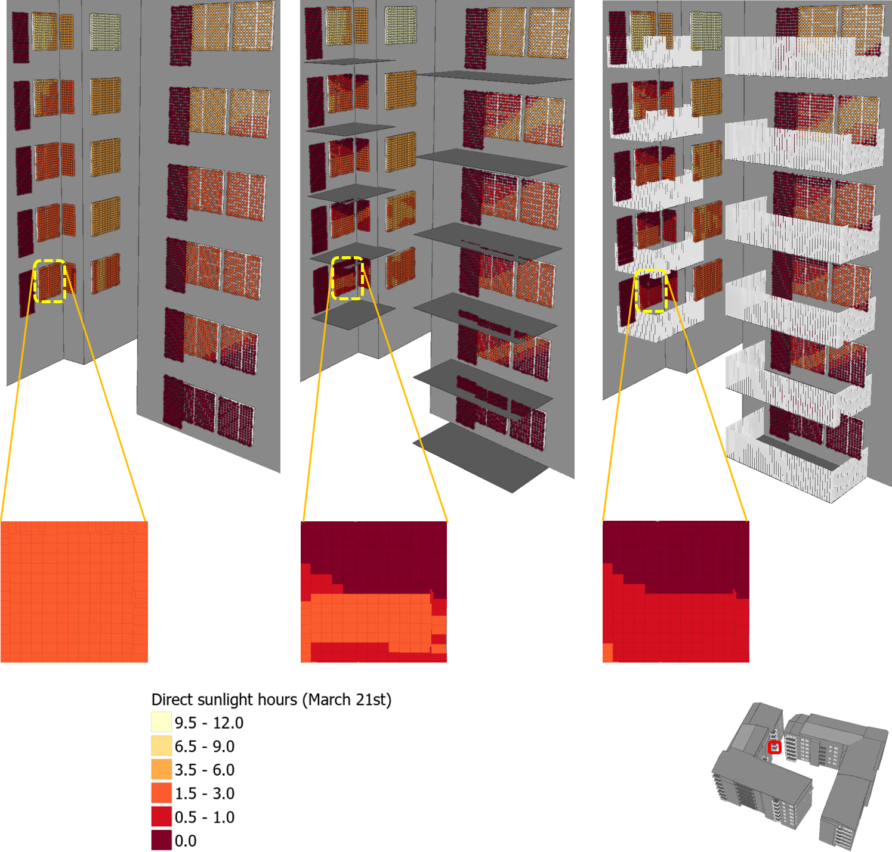

# Direct Sun Hours
The Grasshopper script-file included in this repository is used for computing the direct sun hours on windows and balcony doors of a set of buildings in a neighbourhood. Some of the buildings in the study area are represented in high level of detail (equivalent to [CityGML LOD4](https://www.sciencedirect.com/science/article/pii/S0198971516300436?via%3Dihub)), while others are represented in a lower level of detail (equivalent to [CityGML LOD2](https://www.sciencedirect.com/science/article/pii/S0198971516300436?via%3Dihub)). The goal is to examine how including or excluding obstructing gemmetries (e.g. balconies, balcony railings, etc.) of buildings represented in a high level of detail affect the results of daylight metric simulations such as the Sunlight Exposure (here expressed as direct sun hours).

 
 

## Direct Sunlight Exposure (definition):
Sunlight exposure is regulated by the Swedish Standard, which is based on the European Standard [EN 17037 - *Daylight in Buildings*](https://velcdn.azureedge.net/~/media/marketing/ee/professional/28mai2019%20seminar/veluxen17037tallinn28052019.pdf), and states that at minimum one room in an apartment has to receive at least 1.5 hours of direct sunlight on one day between February 1st and March 21st of a year.

 
 

## Input data:
- 3D city model including detailed building exterior information (equivalent to [CityGML LOD4](https://www.sciencedirect.com/science/article/pii/S0198971516300436?via%3Dihub)) like e.g. windows, balconies, balcony railings, etc. 

 

The below figure depicts a example of a 3D city model that can be used as input. The windows of the *target buildings* for which we are going to compute the direct sun hours for, are highlighted in yellow.

 

</img>

 
 

The next figures give you the opportunity to get a closer look over the *target buildings*.

 
 

</img>&emsp;</img>

 
 

## Requirements:

- An installed version of [Rhino 7](https://www.rhino3d.com/) with the following tools:
  - [Grasshopper](https://www.grasshopper3d.com/)
  - [LadyBug](https://www.ladybug.tools/ladybug.html)

 
 

## Workflow:
The process depicted in this workflow computes the Direct Sun Hour values calculated for March 21st (0.5 min temporal resolution) over a grid of points (0.1m resolution) placed over every window in the target buildings (see figure in *Input data* section). . Finally, this implementation also takes into consideration how including or excluding more detailed facade objects such as balconies and balcony railings affects daylight access (i.e., total hours of direct sunlight per grid point on March 21st). The position of the Sun during that time of the year is estimated based on the latitude for that particular area. The applied methodology is described in the following steps:

 

<ins><b>Step 1:</ins></b> Get the latitude of your study area by first importing a Solemna weather data file over the closest location to the study area and the adding a Ladybug Import Location module. In this case, the study area is located in Malmö, Southern Sweden and the weather file for Copenhagen (Denmark) is is chosen as it is closest to this location.   
<ins><b>Step 2:</ins></b> Set the time-related parameters of the simulation by adding a Ladybug *AnalysisPeriod* module. Define the start- and end-month (here March), the start- and end-day (here 21), the start- and end-hour of day (here 00:00 and 23:00 correspondingly), and the time interval (timestep) for the sampling (here 30 min - expressed in the module as 2 times per hour).   
<ins><b>Step 3:</ins></b> Compute sunpath over current 3D scene for given time period and location using the Ladybug *Sunpath* module.   
<ins><b>Step 4:</ins></b> Add geometries for objects whose surfaces will be used to estimate direct sunlight hours on (e.g. windows, glazed balcony doors, etc.), using the *Geometry Pipeline* module. Use *Merge* to merge their geometries to one.   
<ins><b>Step 5:</ins></b> Add the geometries of objects that will be used as sunlight obstructing surfaces (e.g. all buildings in the study area - including the building parts of the *target buildings* (e.g. facade surfaces, roof surfaces, balconies and balcony railings)) using the *Geometry Pipeline* module. Use *Merge* to merge their geometries to one.   
<ins><b>Step 6:</ins></b> Use the Ladybug *DirectSunHours* module to compute the total sum of direct sunlight hours incident on the gridpoints (0.1m resolution) placed over windows and balcony doors for the 21st of March (from 00:00 - 23:00) at a latitude close to Copenhagen, Denmark from sunpaths created using an 30-min interval.   
<ins><b>Step 7:</ins></b> Add a Ladybug *LegegendPar* module (i.e., legend parameters) to include a legend to the output where the min and max values are set to 0.0 and 12.0 correspondingly (as dates close to the 21st of March correspond to the vernal equinox in the Northern Hemisphere when night and day have the same length).   
<ins><b>Step 8:</ins></b> Add a *Toggle* to control when you wish the script to be executed (*True*: the script executes & *False*: the script does <u>not</u> execute.).   
<ins><b>Step 9:</ins></b> Add a *Size* operation to set the size of the displayed points in the point-grid.   
<ins><b>Step 10:</ins></b> Add 2 *Panels*; one to store the coordinates (x:latitude, y:longitude, z:elevation) for every grid-point, and another to store the corresponding direct sunlight hours every gridpoint receives during the 21st of March. Observe that both panels maintain the same gridpoint ID (i.e. row ID).   

</img>

 
 

<ins><b>Step 11:</ins></b>In order to obtain the total direct sunlight hours for a room that is frequently visited following the requirements of the European daylight directive (stating that this should be measured at a 30cm height above the windows lower frame), you may:
- export the aforementioned panels to a txt.
- import the txt-file with the gridpoint coordinates as lat/lon to a GIS software (e.g. ESRI ArcGIS Pro, QGIS). 
- *Project* the imported gridpoint file to a suitable *Projected Coordinate System* and define a *Vertical Coordinate System*. In this case, the chosen Projected Coordinate System was SWEREF99 13 30 ([EPSG:3008](https://epsg.io/3008)) and the Vertical Coordinate System was [RH2000](https://www.lantmateriet.se/en/geodata/gps-geodesi-och-swepos/reference-systems/height-systems/swedish-height-systems/RH-2000/). 
- Import the txt-file with the direct sunlight hours per gridpoint as a simple table to the GIS software.
- Join the attribute table of the coordinate-file with the results-file based on the row-ID (same as gridpoint ID).
- Export the window and glazed balcony door geometries from Rhino as OGC KML files. You may export all layers in your 3D Scene. 
- Use [FME](https://www.safe.com/) to convert the exported KML file to a multipatch Shapefile (which can be read by ArcGIS Pro). The FME-script is available in this repository under the *code* folder.
  

</img>

 
 
- Import the produced Shapefiles with the window & glazed balcony doors to a *Local Scene* in ArcGIS Pro.
- Compute the window centroid for every window or glazed balcony door using the ArcPy code stored under the *code* folder of this repository. 

  

</img>

 
 

- Use the *[Near 3D](https://pro.arcgis.com/en/pro-app/latest/tool-reference/3d-analyst/near-3d.htm)* tool included in ESRI ArcGIS Pro's 3D Analyst toolbox to define the gridpoint closest to the window centroid point. 
- Set the value of the gridpoint closest to the aperture centroid (window or galzed balcony door) centroid as the number of direct sunlight hours for that aperture. 

 
 
 
 

## Output:

### Rhinocerus (CAD-environment)
The computed Direct Sun Hours for every point in the grid is presented in the Rhino environment as a visual output while the corresponding values along with the grid-point coordinates the refer to are exported to 2 panels inside the Rhino Grasshopper environment. The panel contents can be exported to txt-files and imported to GIS environments for further processing.

</img>

 
 
 
 

</img>

 
 
 
 

### ArcGIS Pro (GIS-environment)
The computed direct sunlight hours imported to ESRI ArcGIS Pro and visualized using an appropriate colormap according making it easy to distinguish which rooms might fail to meet the 1.5 hour direct sunlight requirement of the European Daylight Standard recommendation.
 
 
 
 

</img>

 
 
 
 

## References:

EN 12665:2018, Light and lighting — Basic terms and criteria for specifying lighting requirements.
 

Ladybug Rhino Grasshopper plugins: https://www.ladybug.tools/ladybug.html#solaraccess

 
 
 
 

## License
Copyright 2023 Sustainable3DCities    
The 3-Clause BSD License  
https://opensource.org/licenses/BSD-3-Clause  
   
Redistribution and use in source and binary forms, with or without modification, are permitted provided that the following conditions are met:

1. Redistributions of source code must retain the above copyright notice, this list of conditions and the following disclaimer.

2. Redistributions in binary form must reproduce the above copyright notice, this list of conditions and the following disclaimer in the documentation and/or other materials provided with the distribution.

3. Neither the name of the copyright holder nor the names of its contributors may be used to endorse or promote products derived from this software without specific prior written permission.

THIS SOFTWARE IS PROVIDED BY THE COPYRIGHT HOLDERS AND CONTRIBUTORS "AS IS" AND ANY EXPRESS OR IMPLIED WARRANTIES, INCLUDING, BUT NOT LIMITED TO, THE IMPLIED WARRANTIES OF MERCHANTABILITY AND FITNESS FOR A PARTICULAR PURPOSE ARE DISCLAIMED. IN NO EVENT SHALL THE COPYRIGHT HOLDER OR CONTRIBUTORS BE LIABLE FOR ANY DIRECT, INDIRECT, INCIDENTAL, SPECIAL, EXEMPLARY, OR CONSEQUENTIAL DAMAGES (INCLUDING, BUT NOT LIMITED TO, PROCUREMENT OF SUBSTITUTE GOODS OR SERVICES; LOSS OF USE, DATA, OR PROFITS; OR BUSINESS INTERRUPTION) HOWEVER CAUSED AND ON ANY THEORY OF LIABILITY, WHETHER IN CONTRACT, STRICT LIABILITY, OR TORT (INCLUDING NEGLIGENCE OR OTHERWISE) ARISING IN ANY WAY OUT OF THE USE OF THIS SOFTWARE, EVEN IF ADVISED OF THE POSSIBILITY OF SUCH DAMAGE.
